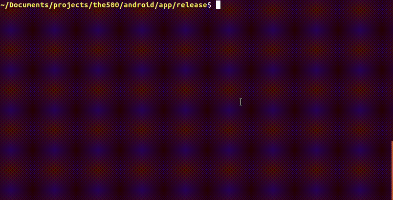

# send
Quick file transfer through email

### Syntax

```
send [fileName] to [emailId] [as [attachmentName]]
```

### Demo



### Example Config

```
{
  "name":"John Doe",
  "smtp_config": {
    "host": "smtp.gmail.com",
    "port": "587",
    "username": "john.doe@gmail.com",
    "password": "mySecretPassword"
  },
  "default_domain": "gmail.com"
}
```

### .bashrc

```
function send(){
	ts-node --project ~/Documents/projects/send/tsconfig.json ~/Documents/projects/send/src/App.ts send "$1" $2 "$3" $4 "$5"
}
```
